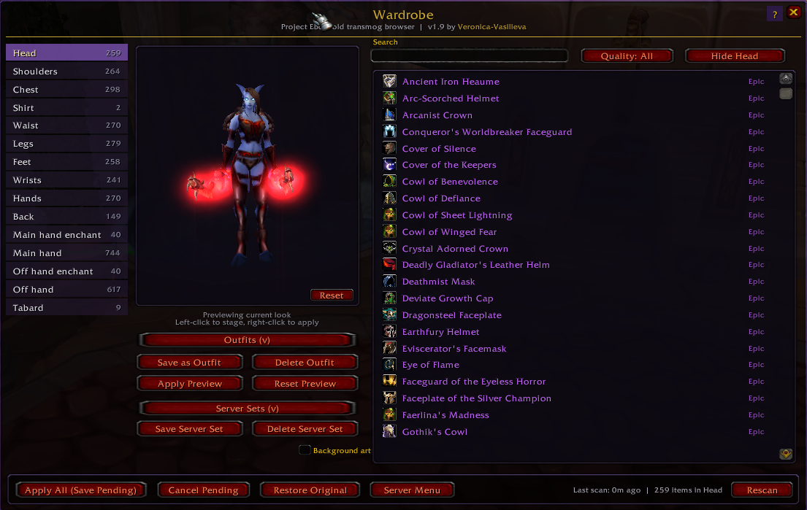

# Wardrobe

Interactive transmog browser for the **Warpweaver** NPC on
Project Ebonhold / Valanior-WoW (a 3.3.5a private server running a
customised fork of Rochet2's transmog module).

The server's native UI is a paginated gossip menu — click a slot, scroll
ten pages of helms, remember a name, do it again for shoulders, repeat.
Wardrobe replaces it with a real interface: searchable per-slot lists, a
rotatable 3D paper-doll preview so you can try outfits before committing
gold to apply them, outfit save/load, and direct integration with the
server's Manage Sets feature.



## Features

- **Per-slot searchable lists** of every appearance you've collected,
  populated by an async scan that walks the gossip menu in the
  background. Items are quality-coloured; tooltips show full item
  details. Name search + quality filter + sort dropdown + collection
  filter (All / Owned / Missing) cycle through the list.
- **Interactive 3D paper doll** with the standard `DressUpModel`
  controls — left-drag rotates, right-drag pans vertically, mouse wheel
  zooms, and a **Reset View** button on the doll restores the default
  camera. Left-clicking any item stages a `TryOn` so you can build a
  full look across multiple slots before committing.
- **Outfit save / load / delete.** Per-character, stored in the addon's
  SavedVariables. Save the current preview under a name, restore it
  from the dropdown, and Apply Preview to commit. Outfit data round-
  trips with hide markers too.
- **Server Sets integration.** The addon scans your server-side Manage
  Sets at the end of every normal scan and lets you Use / Save / Delete
  them from the same panel. Sets are stored server-side so they persist
  across reinstalls and SavedVariables wipes. (Note: applying a set still
  costs the standard per-transmog fee on Ebonhold/Valanior — only the
  paper-doll preview is free.)
- **Enchant illusion slots** (Main hand enchant, Off hand enchant) are
  surfaced as additional pseudo-slots and follow the same flow.
- **Hide slot** stages a "Hide item" preview rather than firing
  immediately — committed by Apply Preview alongside any other staged
  changes, so a single Save Pending popup handles the whole batch.
- **Apply Preview** drains all staged changes through the gossip flow
  one at a time, then auto-clicks Save Pending so the whole batch
  commits in **one cost popup** instead of one per slot.
- **Live cache warming** for items the client has never seen. WoW
  3.3.5a's `GetItemInfo` doesn't auto-fetch from the server — Wardrobe
  works around it with a hidden `GameTooltip:SetHyperlink` scanner
  throttled to ~20 pings/sec. Progress is shown in the bottom-bar
  stamp ("Warming 47/256") so you can watch unfamiliar appearances
  populate live.
- **Custom background art** behind the wardrobe window (purple/gold
  transmog scene). Column backdrops are kept at moderate alpha so the
  art is visible without sacrificing foreground readability.
- **Outfit sharing via chat** — right-click any saved outfit in the
  dropdown for a Load / Share / Delete menu. Share opens a popup
  showing the compact `WBS1:...` code with Ctrl+C-to-copy + direct
  post buttons (Say / Party / Guild). Recipients see the code as a
  clickable purple/gold link in their chat — one click opens the
  import confirmation. Slash variants: `/wb share <Outfit Name>`
  and `/wb import <code>`. Apply still requires the Warpweaver, but
  the outfit save/import doesn't.
- **Right-click context menu on rows** — Apply, Try On (preview),
  Favourite/Unfavourite, and **Hide from List**, in one place. The
  Hide-from-List option buries entries you never want to see (low-tier
  starter gear, irrelevant enchants); turn on **Show hidden items** in
  the doll column to see them again, dimmed, and unhide via the same
  menu.
- **Minimap button** so you can open the wardrobe to browse, favourite,
  and stage outfits anywhere — no need to be at the Warpweaver for
  inspection. Left-click toggles, right-click hides, drag-around-rim
  to reposition; restore a hidden button with `/wb minimap`. Apply
  chains still happen at the NPC.
- **Settings panel** opened via the gold `[S]` gear button (top-right
  of the wardrobe) or `/wb settings`. Five grouped sections: Filters &
  sort cross-refs, Visibility checkboxes, Behaviour (live scan-step-
  delay slider for laggy servers — no `/reload` needed), recognised
  NPC names with add/remove, and a Debug toggle.
- **Sort dropdown** on a second filter row directly below Quality.
  Six orders: Favourites + Quality (default, preserves the v1.13
  bubble-to-top behaviour), Quality high-to-low, Quality low-to-high,
  Name A-Z, Name Z-A, Recently scanned. Persisted per-character.
- **Missing-collections filter** — cycle button beneath Hide Slot that
  rotates All / Owned only / Missing only. The Missing mode shows
  uncollected appearances from a `Data/ItemsBySlot.lua` master list
  (dimmed; Apply blocked, Try On still works). The list ships empty —
  regenerate it from a server item DB via `tools/build_items_list.py`
  if you want the feature populated.
- **Localised UI** — `Locale/` folder with the canonical enUS keys plus
  translation stubs for de/fr/ru/es. Untranslated strings fall back to
  English; community translations welcome via pull request.
- **In-game help** — hover the **?** badge in the top-right of the
  wardrobe for the addon name + version, a one-paragraph About, the
  full slash command list, control reference, license summary, and
  GitHub URL.
- **Server Menu** button hands you back to the native Warpweaver gossip
  (without ending the session) if you ever need a feature the addon
  doesn't surface directly.

## Installation

A step-by-step guide for anyone who isn't comfortable with file
management. The whole process takes about two minutes.

### 1. Close World of Warcraft

If WoW (or your private-server launcher) is running, close it first. WoW
only scans for addons when it starts up, so installing one while the
game is open won't help.

### 2. Download the zip

Open the addon's releases page in any browser:
**https://github.com/Veronica-Vasilieva/Wardrobe/releases**

Click the **green "Latest" tag** at the top of the page (currently
`v1.23`). Under that release's **Assets** section, click
**`Wardrobe-v1.23.zip`** to download it. The file will land in your
`Downloads` folder.

### 3. Find your AddOns folder

This is where WoW expects addons to live. The path is:

```
<your WoW folder>\Interface\AddOns\
```

The hard part is finding `<your WoW folder>`. Common locations on a
Windows PC:

| Source | Typical path |
|---|---|
| Project Ebonhold / Valanior launcher | `C:\Users\<your name>\Valanior-WoW\` or wherever the launcher unpacked it |
| Manual 3.3.5a install | `C:\Program Files\World of Warcraft\` |
| Custom location | wherever you put it when you installed |

**The reliable way to find it:** open your WoW launcher and look for a
"Game Settings", "Installation Path", or similar option — most
private-server launchers expose this directly. Failing that, right-click
your launcher shortcut, choose **Open file location**, and the folder
that opens is your WoW folder.

Once you've found the WoW folder, open it and navigate into the
`Interface\AddOns` subfolder. Create the `AddOns` folder if it doesn't
exist (it's case-insensitive but the spelling matters).

### 4. Extract the zip

Right-click `Wardrobe-v1.23.zip` (in your Downloads folder) and choose
**Extract All...** in the menu. In the dialog that pops up:

- Click **Browse...** and navigate to the `Interface\AddOns` folder you
  found in step 3.
- Click **Extract**.

Windows will create a folder called `Wardrobe` inside `AddOns`. Verify
that the final layout looks exactly like this:

```
<your WoW folder>\
  Interface\
    AddOns\
      Wardrobe\
        CHANGELOG.md
        LICENSE
        README.md
        Wardrobe.toc
        Core.lua
        Scan.lua
        Apply.lua
        ServerSets.lua
        UI_Main.lua
        UI_Settings.lua
        UI_Outfits.lua
        Minimap.lua
        Sharing.lua
        Wardrobe.lua
        Data\
          ItemsBySlot.lua
        Locale\
          Locale.lua
          Locale-deDE.lua
          Locale-frFR.lua
          Locale-ruRU.lua
          Locale-esES.lua
        Media\
          Background.tga
```

### 5. Watch out for the most common mistake

Some zip tools (or some browsers) wrap the contents in an extra folder.
If after extracting you see this instead:

```
AddOns\
  Wardrobe\
    Wardrobe\               ← extra nested folder, bad
      Wardrobe.lua
      ...
```

…you need to flatten it. Open the outer `Wardrobe` folder, select
everything inside the inner `Wardrobe` folder, drag it up into the outer
one, then delete the empty inner folder. The `Wardrobe.lua` file MUST
sit directly inside a folder called `Wardrobe`, not inside
`Wardrobe\Wardrobe`.

Equally, **the folder must be named `Wardrobe` exactly** — not
`Wardrobe-v1.23`, not `Wardrobe-main`, not `Wardrobe (1)`. If yours has
the version or any extra text in the name, right-click it, choose
**Rename**, and change it to just `Wardrobe`.

### 6. Launch the game and enable the addon

Start WoW through your normal launcher. At the character-select screen,
look for an **AddOns** button (usually bottom-left). Click it, find
`Wardrobe` in the list, and make sure its checkbox is ticked. Some
servers enable new addons automatically — if you don't see an AddOns
button at all, that's normal.

Log in to a character. If the install worked, you'll see this line in
your chat window within a second or two:

```
Wardrobe: v1.23 by Veronica-Vasilieva loaded. Talk to a Warpweaver to begin.
```

### 7. Try it out

Find any **Warpweaver** transmog NPC and right-click them. The Wardrobe
window will open in place of the usual gossip menu after an initial scan
of your collection. For a new install the scan can take **20–30 seconds**
if you have a large appearance collection (the addon has to walk every
slot's paginated submenu in the background); thereafter the cache is
reused and the wardrobe opens instantly on subsequent visits. Hover the
`?` badge in the top-right corner of the wardrobe for a quick reference
of every control and command.

### Troubleshooting

- **No "Wardrobe: v1.23 loaded" message at login.** WoW didn't find the
  addon. The folder is in the wrong place or has the wrong name. Recheck
  the layout in step 4 — `Wardrobe.toc` and `Wardrobe.lua` must be
  directly inside a folder called `Wardrobe`, which itself is directly
  inside `Interface\AddOns`.
- **Right-clicking the Warpweaver still shows the old gossip menu.**
  Try `/wb` to open the wardrobe manually. If that says "Unknown
  command," WoW didn't load the addon — see the previous point.
- **The "?" badge tooltip lists controls but the wardrobe is broken in
  some other way.** Type `/wb reset` followed by `/reload`. That wipes
  the cached scan data and starts fresh. Then talk to a Warpweaver
  again to trigger a new scan.
- **You see a Lua error popup mentioning Wardrobe.** Take a screenshot
  of the error (including the line number) and open a
  [GitHub Issue](https://github.com/Veronica-Vasilieva/Wardrobe/issues)
  — I'll usually have a fix out within a day.

## Usage

Talk to a **Warpweaver** NPC. The first interaction triggers a 1–3
second scan of your appearance collection plus a quick detour through
Manage Sets, then the Wardrobe window opens. After that, every visit
reuses the cache (rescan every 30 minutes automatically, or
`/wb rescan` on demand).

### Interactive controls

| Where | Action | What happens |
|---|---|---|
| Item row | Left-click | Stages on the doll (no server cost) |
| Item row | Right-click | Opens menu: Apply / Try On / Favourite / Hide from List |
| Item row | Click the gold star | Toggle favourite (pinned to top with the default sort) |
| Slot tab | Right-click | Clear the staged preview for just that slot |
| Paper doll | Left-drag | Rotate model |
| Paper doll | Right-drag | Pan camera vertically |
| Paper doll | Mouse wheel | Zoom in/out |
| Paper doll | **Reset** button | Restore default camera |

### Buttons

- **Apply Preview** — commits all staged changes in one batch with one
  cost popup
- **Reset Preview** — clears all staged changes and re-syncs the doll
- **Save as Outfit** — stores the current preview under a name (addon
  storage, free)
- **Save Server Set** — costs gold per the server's fee; the saved set
  lives server-side so it survives reinstalls
- **Hide _Slot_** — stages a hide for the active slot (committed by
  Apply Preview)
- **Save Pending** — commits any server-side pending transmogs
- **Cancel Pending** / **Restore Original** — server-side
- **Server Menu** — hand off to the native gossip frame
- **Settings (gold `[S]` gear button, top-right)** — opens the settings
  panel with five grouped sections (Filters & sort, Visibility,
  Behaviour, NPC names, Debug). Also opens with `/wb settings`.

### Filter row (top of the list)

- **Search** — name-substring filter, debounced. Small "X" clears.
- **Quality** — cycle button: All / Uncommon+ / Rare+ / Epic+ / ...
- **Sort** — dropdown: Favourites + Quality (default), Quality desc/asc,
  Name A-Z / Z-A, Recently scanned. Persisted per-character.
- **Hide _Slot_** — stages a hide on the active slot.
- **Collection** — cycle button: All / Owned only / Missing only. The
  Missing mode shows uncollected items dimmed (requires a populated
  `Data/ItemsBySlot.lua`; ships empty and falls back to a hint message
  if not populated).

### Slash commands

| Command | What it does |
|---|---|
| `/wb`, `/wardrobe` | Open / close the wardrobe |
| `/wb settings`, `/wb config`, `/wb options` | Open the settings panel |
| `/wb rescan` | Force a full rescan of your collection and server sets |
| `/wb reset` | Wipe all SavedVariables (requires `/reload`) |
| `/wb debug` | Toggle verbose chat logging (per-page gossip option dump during scans / apply flows) |
| `/wb minimap` | Show / hide the minimap button |
| `/wb minimap reset` | Re-centre the minimap button to its default position |
| `/wb share <Outfit Name>` | Open the share popup for a saved outfit (case-insensitive name match) |
| `/wb import <code>` | Import an outfit from a `WBS1:...` code (or click a code in chat) |
| `/wb npcname <Name>` | Register an alias if your server uses a different name than "Warpweaver" (or use the Settings panel) |

## Server requirements

Wardrobe is built for **Project Ebonhold / Valanior-WoW**'s customised
Rochet2 transmog module:

- Persistent appearance collection (clicking an item adds it, you don't
  need to keep it in your bag)
- Staged "pending transmogrifications" with a single Save Pending commit
- "Manage sets" gossip option in the main menu
- "Show main menu" option on page 1 of each slot submenu
- Per-slot "Hide item" option

If your server has a different gossip layout, scanning may misbehave —
turn on `/wb debug` and `/wb rescan` while at the NPC and the per-page
dump will show what's actually being emitted in chat. Paste the output
in a GitHub Issue and we can adapt.

## Contributors

- **Veronica-Vasilieva** — original author and current maintainer.

Bug reports and pull requests welcome via
[GitHub Issues](https://github.com/Veronica-Vasilieva/Wardrobe/issues).

## License

Source-available — see [LICENSE](LICENSE).

Short version: free to use, modify for personal use, and contribute back.
You may NOT rebrand, redistribute as your own work, repackage on addon
sites under a different author, or sell it. Forks are allowed with a
clearly different name, attribution to this project, and the same
license.
